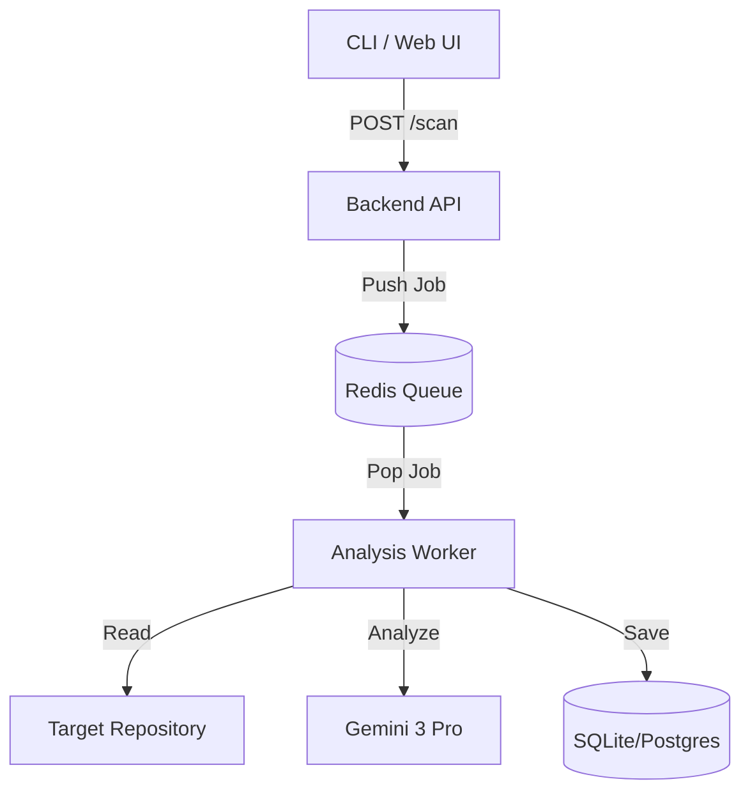
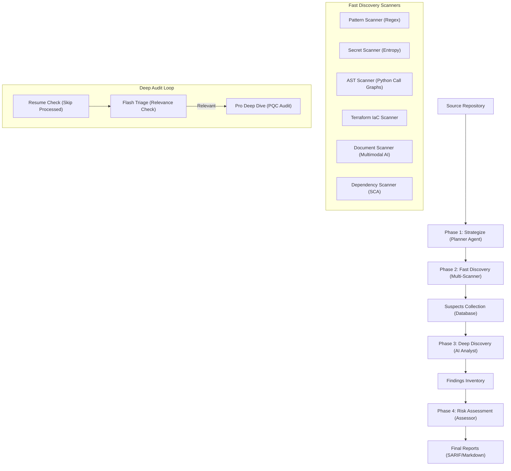

# LatticeGuard - Post-Quantum Cryptography (PQC) Assessment Tool

A specialized tool designed to scan enterprise repositories for cryptographic assets, assess their vulnerability to Quantum Computers (Shor's Algorithm), and generate compliance reports (SARIF/Markdown).

> **Built by PayNet R&D**
>
> ⚠️ **Disclaimer**: This tool is under active development. Please use with care.

## Why "LatticeGuard"?
The name implies **Guarding** your infrastructure using **Lattice-based Cryptography**.
Lattices are the mathematical foundation behind the most resilient Post-Quantum algorithms (like **Kyber** and **Dilithium**). While traditional RSA and Elliptic Curve systems fall to Quantum Computers (Shor's Algorithm), Lattice-based problems (like *Learning With Errors*) remain secure. This tool helps you bridge that gap.


## Key Features
-   **Enterprise Scale**: Uses an event-driven architecture (Redis Queue) to process massive repositories asynchronously.
-   **Expanded Discovery**:
    -   **Code**: Python (AST-based), JS, Java (Maven), Rust (Cargo), Go (go.mod).
    -   **Secrets**: Entropy-based detection for AWS, GCP, and Stripe keys.
    -   **Infra**: Docker, Kubernetes, Terraform.
    -   **Data**: SQL Dumps, Config Files.
    -   **Network**: Live TLS/SSL Handshake Analysis.
    -   **SCA**: Dependency Scanning for known weak libraries (`pycrypto`, `bouncycastle`).
    -   **History**: "Ghost" Scanning to find deleted secrets in `git log`.
-   **Transparency & Costing**: AI analysis now includes detailed reasoning for "Verified Safe" findings and automated token/cost tracking per scan.
-   **IaC Ready**: Native support for scanning Terraform (`.tf`) files for weak TLS policies and cryptographic resource definitions.
-   **Risk Assessment**: Classifies findings based on the NIST PQC Migration Guidelines (including a new "Verify Safe" tier).
-   **Docker Native**: Fully containerized for easy local deployment or cloud scaling.

## Architecture

The system consists of three main components orchestrated via Docker Compose:

1.  **Backend (API)**: A FastAPI server that accepts scan requests and manages the job queue.
2.  **Worker (Agents)**: scalable worker nodes that pick up jobs, clone/mount repositories, and perform the deep analysis.
3.  **Redis**: Acts as the message broker and state manager.



## Analysis Pipeline

LatticeGuard uses a multi-phase orchestrated pipeline to discover, triage, and audit cryptographic assets:



## Discovery Process

The discovery engine operates in four tiered stages to maximize speed and accuracy:

1.  **Phase 1: Strategize**:
    -   The `PlannerAgent` analyzes the repository structure and fingerprints the technology stack to create an optimized scan plan.
2.  **Phase 2: Fast Discovery (Heuristic & Deterministic)**:
    -   **Pattern Scanning**: Regex patterns for known cryptographic extensions and standard library signatures.
    -   **AST-Based Scanning (Python)**: Uses Abstract Syntax Trees to identify exact cryptographic calls (e.g., `generate_private_key`) with high precision.
    -   **Secret Detection**: Entropy analysis and specific provider patterns to find hardcoded keys.
    -   **IaC Scanning**: Native support for **Terraform** (`.tf`) files to identify weak TLS policies and cryptographic resource definitions.
    -   **Document/Multimodal Scanning**: Uses Gemini Flash to analyze architectural diagrams, PDFs, and Markdown files for cryptographic requirements.
    -   **Dependency Scanning**: Parses manifests (`pom.xml`, `go.mod`, `Cargo.toml`) for PQC-vulnerable libraries.
3.  **Phase 3: Deep Discovery (AI Analyst)**:
    -   **Tiered Audit**:
        -   **Flash Triage**: Fast screening of flagged files to dismiss non-cryptographic noise.
        -   **Pro Deep Audit**: Comprehensive analysis by **Gemini Pro** to identify specific PQC vulnerabilities (e.g., RSA-2048) and provide migration paths.
    -   **Resume Support**: Automatically skips files that have already been audited in previous runs of the same ID.
    -   **Real-time Progress**: Displays a clear `[Current/Total]` progress counter during the audit loop.
4.  **Phase 4: Risk Assessment & Reporting**:
    -   The `Assessor` aggregates findings, categorizes them by NIST risk levels, and generates final reports (SARIF for IDEs and Markdown for humans).

## Risk Assessment Logic

Findings are categorized into risk levels based on NIST PQC Migration Guidelines:

| Risk Level | Description | Examples |
| :--- | :--- | :--- |
| **CRITICAL** | Asymmetric Encryption/Signing (Shor's Target) | RSA-2048, ECDSA, Diffie-Hellman |
| **HIGH** | Legacy Hashing or Weak Symmetric | SHA-1, MD5, DES |
| **LOW** | Quantum Safe or Robust Symmetric | AES-256, SHA-3, Kyber-768 |
| **SAFE** | AI-Verified Non-Cryptographic Asset | Cleared infrastructure configs |
| **INFO** | Configuration or Non-Critical | TLS Versions, Random Number Generators |

## Detailed Uses & Real-World Scenarios

### 1. Enterprise Audit & Migration Planning
**Scenario**: A financial institution needs to migrate 5,000 microservices to Quantum-Safe algorithms by 2028.
-   **Solution**: Run `pqc-assessment` in **Batch Mode** against the entire GitLab organization.
-   **Outcome**: Generates a unified dashboard showing exactly which repos still use `RSA-2048` or `AES-CBC`, prioritized by risk level.

### 2. Supply Chain Security Check
**Scenario**: A developer wants to use a popular open-source library but needs to ensure it doesn't introduce legacy crypto vulnerabilities.
-   **Solution**: `curl -X POST /scan -d '{"repo_path": "https://github.com/popular/library"}'`
-   **Outcome**: The specific library is cloned and scanned effectively before even running `pip install` or `npm install`.

### 3. CI/CD Pipeline Guardrails
**Scenario**: Preventing new weak crypto from entering the codebase.
-   **Solution**: Integrate the scanner into GitHub Actions / Jenkins.
-   **Outcome**: The build fails if `scanner/patterns.py` detects usage of `MD5` or `DES` in the diff, providing immediate feedback to the developer.

## Test Scenarios (PQC Focused)

The system is rigorously tested against critical Post-Quantum Cryptography risk scenarios:

### 1. Shor's Algorithm Vulnerability Detection (Asymmetric Crypto)
-   **Goal**: Identify Key Exchange and Digital Signature algorithms that are vulnerable to Shor's Algorithm.
-   **Scenario**: Code implements `RSA-2048` for encryption or `ECDSA (P-256)` for signatures.
-   **Validation**:
    -   Scanner flags `RSA` / `Diffie-Hellman` / `ECC` as **CRITICAL**.
    -   AI suggests migration to Kyber (Key Enc) or Dilithium (Signatures).

### 2. Hybrid Cryptography Verification
-   **Goal**: Validate the presence of defense-in-depth "Hybrid" schemes during the migration window.
-   **Scenario**: A TLS configuration negotiates `ECDHE_RSA_WITH_AES_128_GCM_SHA256` (Classic) vs `X25519Kyber768Draft00` (Hybrid).
-   **Validation**:
    -   Classic TLS is flagged as **HIGH** risk (Harvest Now, Decrypt Later).
    -   Hybrid / PQC-only TLS is marked as **COMPLIANT** (Low Risk).

### 3. Weak Symmetric Key Sizes (Grover's Algorithm)
-   **Goal**: Detect symmetric keys that are insufficient against Grover's Search (which halves effective key space).
-   **Scenario**: Application uses `AES-128`.
-   **Validation**:
    -   Flagged as **MEDIUM/HIGH** risk.
    -   Recommendation provided to upgrade to `AES-256` or `ChaCha20-Poly1305` where 256-bit keys are standard.

### 4. Vulnerability Detection in Dependencies
-   **Goal**: Ensure SCA (Software Composition Analysis) catches outdated crypto libraries.
-   **Scenario**: A `requirements.txt` includes `pycrypto` (unsafe).
-   **Validation**: The scanner flags the library itself as a risk vector.

## Usage Guidelines

LatticeGuard can be operated via its REST API or the specialized CLI tools.

### Backend API Reference

The API runs on `http://localhost:8000` by default.

#### 1. Start a Single Repository Scan
```bash
curl -X POST http://localhost:8000/scan \
     -H "Content-Type: application/json" \
     -d '{"repo_path": "https://github.com/google/guava.git", "scan_type": "full"}'
```

#### 2. Start a Batch Scan (Financial Context / Microservices)
Submit a list of repository URLs to be processed in parallel across the worker fleet.
```bash
curl -X POST http://localhost:8000/batch/scan \
     -H "Content-Type: application/json" \
     -d '["https://github.com/org/repo1.git", "https://github.com/org/repo2.git"]'
```

#### 3. Get Organization-Wide Risk Summary
Aggregates findings across all jobs to provide a "Leadership Dashboard" view.
```bash
curl http://localhost:8000/reports/summary
```

### CLI & Automation

#### 1. Scan an Entire GitHub Organization
Use the `org_scanner.py` tool to crawl an organization and trigger LatticeGuard.
```bash
# Set your GitHub token first
export GITHUB_TOKEN="your_token"

# Run the scanner
python3 cli/org_scanner.py "your-org-name"
```

#### 2. Interactive CLI (Development)
For local testing without the full API stack:
```bash
python3 cli/main.py scan ./local-folder
```

### CLI Options

The `scan` command supports several flags to customize the depth and behavior of the assessment:

| Flag | Type | Description |
| :--- | :--- | :--- |
| `repo_path` | **Required** | Path to the local repository or directory to scan. |
| `--run-id` | Optional | Restore/Resume a specific scan session ID (e.g., `scan_20240101_120000`). |
| `--max-files` | Option | Limit the number of files processed (Default: 1000). |
| `--skip-fast` | Flag | Skip Phase 2 (Regex/AST/Entropy) and go straight to AI Audit. |
| `--skip-deep` | Flag | Skip Phase 3 (AI Audit) and only run fast deterministic scanners. |
| `--skip-multimodal`| Flag | Skip AI analysis of images and PDFs (speeds up scan significantly). |
| `--scan-history` | Flag | **TruffleHog Mode**: Scan `git log` to find secrets deleted in previous commits. |
| `--verify-secrets` | Flag | **Gitleaks Mode**: Attempt to verify detected secrets against live APIs (e.g. AWS). |

### Local Scanning
By default, LatticeGuard restricts scans to **remote git URLs** (e.g., `https://github.com/...`) for security.
To scan directories on your local machine (or the worker's filesystem), you must explicitly enable it:

```bash
# 1. Export the security flag
export ALLOW_LOCAL_SCAN="true"

# 2. Run the scan
python3 cli/main.py scan /Users/yourname/projects/my-repo
```

> **Note**: When running via Docker, "local" refers to the *container's* filesystem. You will need to mount your local source code into the worker container (e.g., via `-v /my-src:/data/source`) to scan it.

## Configuration

### AI Provider Setup

LatticeGuard defaults to the **Google Native** provider (`google-generativeai`). To use **LiteLLM** (supporting OpenAI, Anthropic, Azure, etc.), set the following environment variables:

1.  **Enable LiteLLM**:
    ```bash
    export AI_PROVIDER="litellm"
    ```

2.  **Configure Model & Keys**:
    Set the standard keys for your model provider (automatically detected by LiteLLM).

    **Example: OpenAI (GPT-4)**
    ```bash
    export OPENAI_API_KEY="sk-..."
    export LITELLM_MODEL="gpt-4"
    ```

    **Example: Anthropic (Claude 3)**
    ```bash
    export ANTHROPIC_API_KEY="sk-ant-..."
    export LITELLM_MODEL="claude-3-opus-20240229"
    ```

    **Example: Google via LiteLLM**
    ```bash
    export GEMINI_API_KEY="AIza..."
    export LITELLM_MODEL="gemini/gemini-1.5-pro"
    ```

    > **⚠️ Important LiteLLM Note**: 
    > If `GEMINI_FLASH_MODEL` or `GEMINI_PRO_MODEL` are set in your environment (or `.env`), they will **take precedence** over `LITELLM_MODEL` for specific agent tasks. 
    > If using a non-Gemini provider (e.g. OpenAI), ensure you override these to match your target model (e.g., `export GEMINI_FLASH_MODEL="gpt-4o-mini"`).

## Getting Started

1.  **Environment Setup**:
    Copy `.env.example` to `.env` and add your `GEMINI_API_KEY`.
2.  **Start Services**:
    ```bash
    docker-compose up --build -d
    ```
3.  **Scale Workers** (Optional - For Enterprise Scale):
    ```bash
    docker-compose up --scale worker=10 -d
    ```

## Testing
Run the comprehensive test suite inside the container environment:
```bash
docker-compose run worker pytest
```
