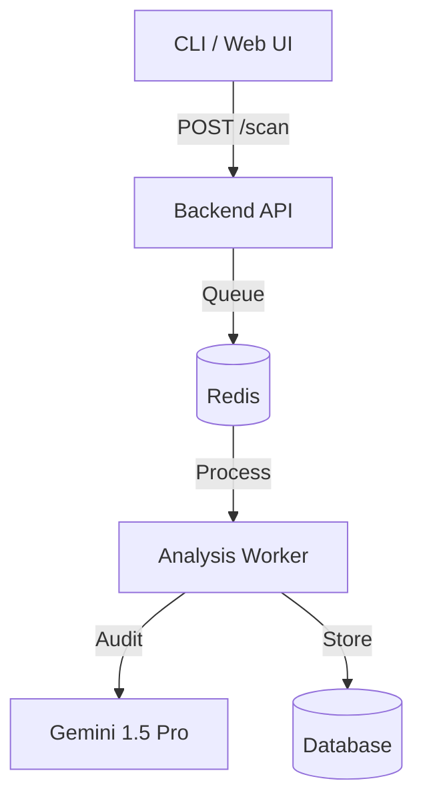

# LatticeGuard: Post-Quantum Cryptography Assessment Tool

LatticeGuard is an enterprise-grade platform designed to identify, assess, and manage cryptographic risks in the transition to Post-Quantum Cryptography (PQC). It provides multi-layer visibility across application code, infrastructure, and network endpoints, prioritizing risks using the "Harvest Now, Decrypt Later" (HNDL) model.

Built with a focus on lattice-based cryptography resilience, the tool supports automated discovery of PQC-vulnerable assets and provides actionable migration paths aligned with NIST and CNSA standards.

---

## Core Capabilities

### Discovery Layers
- **Advanced SAST**: AST-based analysis for Java, C++, Python, Go, and JavaScript using Tree-sitter for high-fidelity detection.
- **Infrastructure as Code (IaC)**: Native parsing for Kubernetes manifests, Terraform, and CloudFormation to identify kms and TLS misconfigurations.
- **External Attack Surface (EASM)**: Discovery of shadow IT and legacy protocols (FTP, Telnet) via active auditing and Shodan/Censys integration.
- **Supply Chain (SCA)**: Transitive dependency resolution for Go and Python manifests to flag PQC-vulnerable libraries.
- **Git History Mining**: Analysis of commit logs to uncover hardcoded secrets or keys deleted in previous commits.

### Risk & Analysis
- **HNDL Risk Scoring**: Proprietary risk model incorporating data longevity, sensitivity, and algorithm strength.
- **Protocol Auditor**: Active handshake simulation to probe for Kyber (ML-KEM) and ML-DSA support on remote endpoints.
- **Quantum Resilience Score**: A 0-100 metric evaluating the overall quantum readiness of a target service or repository.
- **AI Secret Triage**: Gemini-based filtering to reduce credential noise and prioritize valid risks.
- **Live Verification**: Automated validation of detected secrets (e.g., AWS, GitHub) against provider APIs.

### Compliance & Reporting
- **Cryptographic BOM (CBOM)**: Automated generation of Cryptographic Bill of Materials in CycloneDX 1.6 format.
- **NIST/CNSA Alignment**: Professional PDF reports mapping findings to NIST SP 800-208 and CNSA 2.0 timelines.
- **Blast Radius Visualization**: Interactive graph-based analysis of cryptographic dependency propagation.
- **Agility Dashboard**: Tracking of algorithm distribution and cryptographic agility across the organization.

---

## Architecture

LatticeGuard utilizes a distributed architecture orchestrated via Docker:

1.  **Backend (API)**: FastAPI server managing job queues and reporting.
2.  **Worker (Agent)**: Scalable nodes performing deep AST analysis and AI-tiered auditing.
3.  **Redis**: Message broker for task distribution and state management.



---

## Getting Started

### Prerequisites
- Docker and Docker Compose
- Google Gemini API Key

### Installation
1. Clone the repository and configure the environment:
   ```bash
   cp .env.example .env
   # Add your GEMINI_API_KEY to .env
   ```
2. Start the services:
   ```bash
   docker-compose up --build -d
   ```

### Running Your First Scan
Trigger a scan via the CLI:
```bash
python3 cli/cicd_scanner.py scan ./your-repo
```

---

## Usage

### Command Line Interface
LatticeGuard provides a rich CLI for local and organizational assessment:

- **Local Scan**: `python3 cli/cicd_scanner.py scan <path>`
- **Cloud Discovery**: `python3 cli/cicd_scanner.py discover aws --region us-east-1`
- **EASM Audit**: `python3 cli/cicd_scanner.py easm <target-cidr>`
- **Report Generation**: `python3 cli/cicd_scanner.py report pdf --job-id <id>`

### REST API
Automate scans into your CI/CD pipelines:

- **Submit Scan**: `POST /scan` with `{"repo_path": "..."}`
- **Retrieve CBOM**: `GET /reports/cbom`
- **Agility Distribution**: `GET /agility/metrics`

---

## Configuration

The tool can be customized via `.latticeguard.yaml` in the repository root:

```yaml
# Suppression Rules
suppressions:
  paths:
    - "**/tests/**"
  algorithms:
    - "RSA-4096" # Accepted risk

# HNDL Parameters
hndl:
  default_longevity: 5
  sensitivity_map:
    "*.db": "confidential"

# AI Provider
ai:
  provider: "google" # Supports "litellm" for multi-cloud AI
```

---

## Risk Philosophy

Findings are categorized based on their vulnerability to quantum attacks (specifically Shor's Algorithm):

| Level | Definition |
| :--- | :--- |
| **Critical** | Asymmetric algorithms (RSA, ECDSA) vulnerable to Shor's. |
| **High** | Legacy hashing (MD5, SHA-1) or weak symmetric keys. |
| **Medium** | AES-128 or other algorithms requiring Grover's search mitigation. |
| **Low** | Quantum-safe standards (ML-KEM, ML-DSA) or robust symmetric (AES-256). |

---

## Development and Testing
LatticeGuard is built for extensibility. To run tests:
```bash
docker-compose run worker pytest
```

For more details, visit the [Documentation Portal](docs/).
