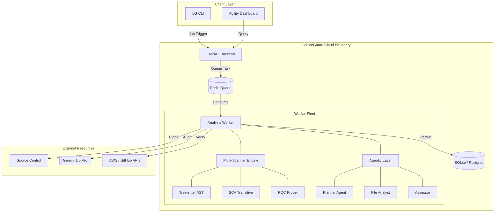
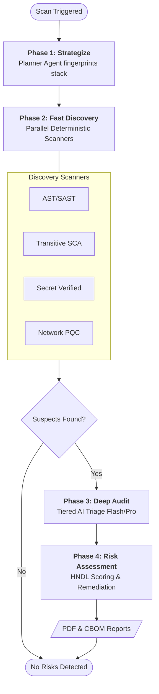

# LatticeGuard: Post-Quantum Cryptography Assessment Tool

> **Built by PayNet R&D**

LatticeGuard is an enterprise-grade platform designed to identify, assess, and manage cryptographic risks in the transition to Post-Quantum Cryptography (PQC). It provides multi-layer visibility across application code, infrastructure, and network endpoints, prioritizing risks using the "Harvest Now, Decrypt Later" (HNDL) model.

Built with a focus on lattice-based cryptography resilience, the tool supports automated discovery of PQC-vulnerable assets and provides actionable migration paths aligned with NIST and CNSA standards.

---

## Core Capabilities

### Discovery Layers
- **Advanced SAST**: AST-based analysis for Java, C++, Python, Go, and JavaScript using Tree-sitter for high-fidelity detection.
- **Infrastructure as Code (IaC)**: Native parsing for Kubernetes manifests, Terraform, and CloudFormation to identify kms and TLS misconfigurations.
- **External Attack Surface (EASM)**: Discovery of shadow IT and legacy protocols (FTP, Telnet) via active auditing and Shodan/Censys integration.
- **Supply Chain (SCA)**: Transitive dependency resolution for Go and Python manifests to flag PQC-vulnerable libraries.
- **Git History Mining**: Analysis of commit logs to uncover hardcoded secrets or keys deleted in previous commits.

### Risk & Analysis
- **HNDL Risk Scoring**: Proprietary risk model incorporating data longevity, sensitivity, and algorithm strength.
- **Protocol Auditor**: Active handshake simulation to probe for Kyber (ML-KEM) and ML-DSA support on remote endpoints.
- **Quantum Resilience Score**: A 0-100 metric evaluating the overall quantum readiness of a target service or repository.
- **AI Secret Triage**: Gemini-based filtering to reduce credential noise and prioritize valid risks.
- **Live Verification**: Automated validation of detected secrets (e.g., AWS, GitHub) against provider APIs.

### Compliance & Reporting
- **Cryptographic BOM (CBOM)**: Automated generation of Cryptographic Bill of Materials in CycloneDX 1.6 format.
- **NIST/CNSA Alignment**: Professional PDF reports mapping findings to NIST SP 800-208 and CNSA 2.0 timelines.
- **Blast Radius Visualization**: Interactive graph-based analysis of cryptographic dependency propagation.
- **Agility Dashboard**: Tracking of algorithm distribution and cryptographic agility across the organization.

---

---

## Architecture & Data Flow

LatticeGuard utilizes a distributed, asynchronous architecture designed for high-throughput enterprise scanning.

### System Architecture
The system consists of three main tiers orchestrated via Docker Compose:
1.  **Backend (FastAPI)**: Manages job lifecycle, provides REST endpoints for CI/CD, and serves reporting data.
2.  **Message Broker (Redis)**: Orchestrates tasks and handles real-time status updates via Pub/Sub.
3.  **Worker Fleet**: Decentralized nodes that execute the heavy lifting—cloning repos, running SAST/SCA scanners, and managing the AI agent loop.



### Analysis Pipeline Flow
The discovery engine operates in four tiered stages to maximize speed and accuracy:



---

---

## Getting Started

### Prerequisites
- Docker and Docker Compose
- Google Gemini API Key

### Installation
1. Clone the repository and configure the environment:
   ```bash
   cp .env.example .env
   # Add your GEMINI_API_KEY to .env
   ```
2. Start the services:
   ```bash
   docker-compose up --build -d
   ```

### Running Your First Scan
Trigger a scan via the CLI:
```bash
python3 cli/cicd_scanner.py scan ./your-repo
```

---

## Usage

### Command Line Interface

LatticeGuard provides a comprehensive CLI for PQC vulnerability assessment. All commands are run via:

```bash
python3 cli/cicd_scanner.py <command> [options]
```

---

### `scan` - Vulnerability Scanning

Scan a repository or directory for PQC vulnerabilities with HNDL risk scoring.

```bash
python3 cli/cicd_scanner.py scan <path> [options]
```

| Flag | Type | Default | Description |
| :--- | :--- | :--- | :--- |
| `path` | required | - | Path to repository or directory to scan |
| `--fail-on` | `low\|medium\|high\|critical` | `high` | Minimum severity to cause exit code 2 (failure) |
| `--format` | `table\|json\|sarif` | `table` | Output format |
| `-o, --output` | string | stdout | Output file path |
| `--longevity` | int | `5` | Data retention period in years (for HNDL scoring) |
| `--sensitivity` | `public\|internal\|confidential\|secret\|pii\|financial\|health` | `internal` | Data sensitivity classification |
| `-q, --quiet` | flag | false | Suppress progress output |
| `-c, --config` | string | `.latticeguard.yaml` | Path to configuration file |

**Examples:**
```bash
# Basic scan with table output
python3 cli/cicd_scanner.py scan ./src

# CI/CD pipeline with SARIF for GitHub Security
python3 cli/cicd_scanner.py scan ./src --format sarif -o results.sarif --fail-on high

# Financial data with 7-year retention
python3 cli/cicd_scanner.py scan ./src --longevity 7 --sensitivity financial
```

**Exit Codes:**
- `0` = Pass (no findings above threshold)
- `1` = Warnings (findings exist but below threshold)
- `2` = Failure (findings at or above threshold)

---

### `temporal-risk` - Time-to-CRQC Assessment

Calculate temporal risk based on estimated CRQC (Cryptographically Relevant Quantum Computer) arrival.

```bash
python3 cli/cicd_scanner.py temporal-risk <path> [options]
```

| Flag | Type | Default | Description |
| :--- | :--- | :--- | :--- |
| `path` | required | - | Path to repository to scan |
| `--retention` | int | `7` | Data retention period in years |
| `--format` | `table\|json` | `table` | Output format |

**CRQC Estimate:** 2028 (±3 years)

**Examples:**
```bash
# Default 7-year retention
python3 cli/cicd_scanner.py temporal-risk ./src

# Financial records with 10-year retention
python3 cli/cicd_scanner.py temporal-risk ./src --retention 10

# JSON output for automation
python3 cli/cicd_scanner.py temporal-risk ./src --format json
```

**Output Fields:**
- `urgency`: CRITICAL / HIGH / MEDIUM / LOW
- `years_to_act`: Time remaining before migration is critical
- `data_exposure_window_years`: Years data will be at risk post-CRQC

---

### `blast-radius` - Algorithm Impact Analysis

Analyze the blast radius of algorithm compromise across components and data flows.

```bash
python3 cli/cicd_scanner.py blast-radius <path> [options]
```

| Flag | Type | Default | Description |
| :--- | :--- | :--- | :--- |
| `path` | required | - | Path to repository to scan |
| `--format` | `table\|json` | `table` | Output format |

**Examples:**
```bash
# Table output with component mapping
python3 cli/cicd_scanner.py blast-radius ./src

# JSON for integration with dashboards
python3 cli/cicd_scanner.py blast-radius ./src --format json
```

**Output Fields:**
- `algorithm`: Cryptographic algorithm in use
- `file_count`: Number of files using this algorithm
- `affected_components`: Services/modules impacted (e.g., payment-service, auth-service)
- `affected_flows`: Data flows at risk (e.g., token management, digital signatures)

---

### `migration-effort` - PQC Migration Planning

Estimate migration complexity and developer hours for PQC remediation.

```bash
python3 cli/cicd_scanner.py migration-effort <path> [options]
```

| Flag | Type | Default | Description |
| :--- | :--- | :--- | :--- |
| `path` | required | - | Path to repository to scan |
| `--format` | `table\|json` | `table` | Output format |

**Complexity Levels:**

| Level | Description | Hours |
| :--- | :--- | :--- |
| `trivial` | Config change (TLS version) | 0.5h |
| `easy` | Library upgrade (drop-in) | 2h |
| `medium` | Algorithm swap (same API) | 8h |
| `hard` | Key management refactor | 24h |
| `major_refactor` | Full crypto redesign | 80h+ |

**Examples:**
```bash
# Get migration effort summary
python3 cli/cicd_scanner.py migration-effort ./src

# JSON output with per-finding details
python3 cli/cicd_scanner.py migration-effort ./src --format json
```

---

### `compliance` - Regulatory Mapping

Map findings to compliance frameworks (BNM RMiT, PCI-DSS 4.0, NIST).

```bash
python3 cli/cicd_scanner.py compliance <path> [options]
```

| Flag | Type | Default | Description |
| :--- | :--- | :--- | :--- |
| `path` | required | - | Path to repository to scan |
| `--framework` | `all\|bnm-rmit\|pci-dss\|nist` | `all` | Compliance framework to map |
| `--format` | `table\|json` | `table` | Output format |
| `-o, --output` | string | stdout | Output file for audit report |

**Supported Frameworks:**
- **BNM RMiT**: 10.49 (Crypto Controls), 10.50 (Key Management), 10.51 (Encryption in Transit)
- **PCI-DSS 4.0**: 3.5 (Stored Data), 4.2.1 (Strong Crypto), 4.2.2 (Certificate Validation)
- **NIST SP 800-131A**: RSA, ECDSA, Hash requirements

**Examples:**
```bash
# Full compliance mapping
python3 cli/cicd_scanner.py compliance ./src

# Audit report for BNM submission
python3 cli/cicd_scanner.py compliance ./src --format json -o audit_report.json

# PCI-DSS focus only
python3 cli/cicd_scanner.py compliance ./src --framework pci-dss
```

---

### `cbom` - Cryptographic Bill of Materials

Generate a Cryptographic Bill of Materials in CycloneDX format.

```bash
python3 cli/cicd_scanner.py cbom <path> [options]
```

| Flag | Type | Default | Description |
| :--- | :--- | :--- | :--- |
| `path` | required | - | Path to repository to scan |
| `-o, --output` | string | stdout | Output file path |
| `--format` | `json\|cyclonedx` | `cyclonedx` | Output format |

**Examples:**
```bash
# Generate CycloneDX CBOM
python3 cli/cicd_scanner.py cbom ./src -o cbom.json

# Raw JSON format
python3 cli/cicd_scanner.py cbom ./src --format json
```

**CBOM Contents:**
- Algorithm inventory (RSA, ECDSA, AES, etc.)
- Key sizes and library versions
- PQC vulnerability status
- HNDL risk scores
- Recommended alternatives

---

### `discover` - Cloud Asset Discovery

Discover cryptographic assets in cloud providers (AWS, GCP, Azure).

```bash
python3 cli/cicd_scanner.py discover <provider> [options]
```

| Flag | Type | Default | Description |
| :--- | :--- | :--- | :--- |
| `provider` | `aws\|gcp\|azure\|mock` | required | Cloud provider to scan |
| `--region` | string | - | Cloud region to scan |
| `--format` | `table\|json` | `table` | Output format |

**Examples:**
```bash
# Discover AWS KMS keys and certificates
python3 cli/cicd_scanner.py discover aws --region us-east-1

# Azure Key Vault discovery
python3 cli/cicd_scanner.py discover azure --region eastus
```

---

### `agility` - Cryptographic Agility Report

Show algorithm distribution and agility metrics.

```bash
python3 cli/cicd_scanner.py agility [options]
```

| Flag | Type | Default | Description |
| :--- | :--- | :--- | :--- |
| `--format` | `table\|json` | `table` | Output format |
| `--vulnerable-only` | flag | false | Show only PQC-vulnerable algorithms |

**Examples:**
```bash
# Full agility report
python3 cli/cicd_scanner.py agility

# Only vulnerable algorithms
python3 cli/cicd_scanner.py agility --vulnerable-only
```

---

### `probe` - TLS/PQC Endpoint Scanning

Probe a live TLS endpoint to assess its quantum resilience and PQC readiness.

```bash
python3 cli/cicd_scanner.py probe <url> [options]
```

| Flag | Type | Default | Description |
| :--- | :--- | :--- | :--- |
| `url` | required | - | URL or hostname to probe (e.g., `https://example.com` or `example.com`) |
| `--port` | int | `443` | Port to connect to |
| `--format` | `table\|json` | `table` | Output format |
| `-o, --output` | string | stdout | Output file path |

**Examples:**
```bash
# Scan Bank Negara Malaysia
python3 cli/cicd_scanner.py probe https://www.bnm.gov.my/

# Scan with JSON output
python3 cli/cicd_scanner.py probe paynet.my --format json

# Scan non-standard port
python3 cli/cicd_scanner.py probe internal.example.com --port 8443

# Save report to file
python3 cli/cicd_scanner.py probe example.com -o tls_report.txt
```

**Output Fields:**
- `algorithm`: TLS cipher suite in use
- `quantum_resilience_score`: 0-100 score (70+ = PQC-Ready)
- `pqc_vulnerable`: Whether key exchange is quantum vulnerable
- `remediation`: Recommended actions for PQC migration

**Exit Codes:**
- `0` = PQC-Ready (score ≥ 70)
- `1` = Partially Ready (score 40-69)
- `2` = Quantum Vulnerable (score < 40)

---

### REST API

Automate scans into your CI/CD pipelines:

- **Submit Scan**: `POST /scan` with `{"repo_path": "..."}`
- **Retrieve CBOM**: `GET /reports/cbom`
- **Agility Distribution**: `GET /agility/metrics`

---

## Configuration

The tool can be customized via `.latticeguard.yaml` in the repository root:

```yaml
# Suppression Rules
suppressions:
  paths:
    - "**/tests/**"
  algorithms:
    - "RSA-4096" # Accepted risk

# HNDL Parameters
hndl:
  default_longevity: 5
  sensitivity_map:
    "*.db": "confidential"

# AI Provider
ai:
  provider: "google" # Supports "litellm" for multi-cloud AI
```

---

## Risk Philosophy

Findings are categorized based on their vulnerability to quantum attacks (specifically Shor's Algorithm):

| Level | Definition |
| :--- | :--- |
| **Critical** | Asymmetric algorithms (RSA, ECDSA) vulnerable to Shor's. |
| **High** | Legacy hashing (MD5, SHA-1) or weak symmetric keys. |
| **Medium** | AES-128 or other algorithms requiring Grover's search mitigation. |
| **Low** | Quantum-safe standards (ML-KEM, ML-DSA) or robust symmetric (AES-256). |

---

## Development and Testing
LatticeGuard is built for extensibility. To run tests:
```bash
docker-compose run worker pytest
```

For more details, visit the [Documentation Portal](docs/).
