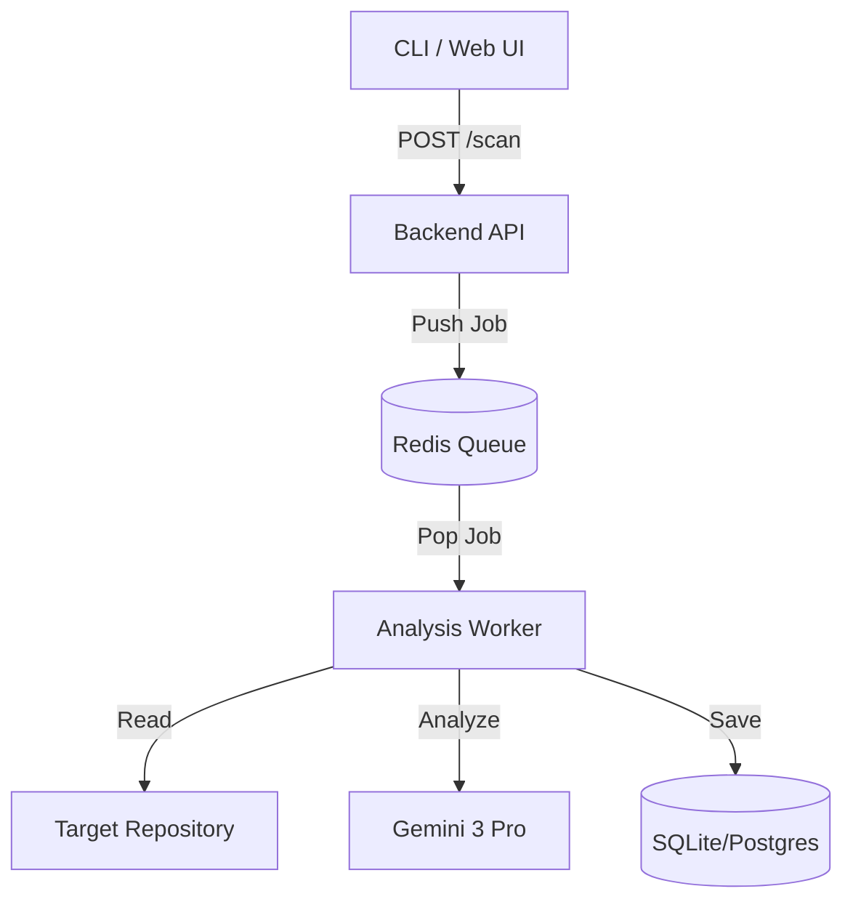

# LatticeGuard 🛡️ - Post-Quantum Cryptography (PQC) Assessment Tool

A specialized tool designed to scan enterprise repositories for cryptographic assets, assess their vulnerability to Quantum Computers (Shor's Algorithm), and generate compliance reports (SARIF/Markdown).

## 🚀 Key Features
-   **Enterprise Scale**: Uses an event-driven architecture (Redis Queue) to process massive repositories asynchronously.
-   **Smart Discovery**: Combines heuristic file analysis (extensions, magic numbers).
-   **IaC Ready**: Native support for scanning Terraform (`.tf`) files for weak TLS policies and cryptographic resource definitions.
-   **Risk Assessment**: Classifies findings based on the NIST PQC Migration Guidelines.
-   **Docker Native**: Fully containerized for easy local deployment or cloud scaling.

## 🏗 Architecture

The system consists of three main components orchestrated via Docker Compose:

1.  **Backend (API)**: A FastAPI server that accepts scan requests and manages the job queue.
2.  **Worker (Agents)**: scalable worker nodes that pick up jobs, clone/mount repositories, and perform the deep analysis.
3.  **Redis**: Acts as the message broker and state manager.



## 🔍 Discovery Process

The discovery engine operates in two stages to maximize speed and accuracy:

1.  **Heuristic Scan (Fast)**:
    -   Scans file system for known cryptographic extensions (`.pem`, `.crt`, `.jks`).
    -   Uses Regex patterns to find standard library usage (e.g., `import hashlib`, `MessageDigest.getInstance`).
2.  **AI Audit (Deep)**:
    -   For complex code blocks or custom implementations, the file content is sent to **Gemini 3 Pro**.
    -   The AI determines if the code implements a Quantum-Vulnerable algorithm (e.g., RSA, ECC) or a Quantum-Safe one (e.g., Kyber, Dilithium).

## 🛡 Risk Assessment Logic

Findings are categorized into risk levels based on their resistance to Quantum Attacks:

| Risk Level | Description | Examples |
| :--- | :--- | :--- |
| **CRITICAL** | Asymmetric Encryption/Signing (Shor's Algo Target) | RSA-2048, ECDSA, Diffie-Hellman |
| **HIGH** | Legacy Hashing or Weak Symmetric | SHA-1, MD5, DES |
| **LOW** | Quantum Safe or Robust Symmetric | AES-256, SHA-3, Kyber-768 |
| **INFO** | Configuration or Non-Critical | TLS Versions, Random Number Generators |

## � Real-World Use Cases

### 1. Enterprise Audit & Migration Planning
**Scenario**: A financial institution needs to migrate 5,000 microservices to Quantum-Safe algorithms by 2028.
-   **Solution**: Run `pqc-assessment` in **Batch Mode** against the entire GitLab organization.
-   **Outcome**: Generates a unified dashboard showing exactly which repos still use `RSA-2048` or `AES-CBC`, prioritized by risk level.

### 2. Supply Chain Security Check
**Scenario**: A developer wants to use a popular open-source library but needs to ensure it doesn't introduce legacy crypto vulnerabilities.
-   **Solution**: `curl -X POST /scan -d '{"repo_path": "https://github.com/popular/library"}'`
-   **Outcome**: The specific library is cloned and scanned effectively before even running `pip install` or `npm install`.

### 3. CI/CD Pipeline Guardrails
**Scenario**: Preventing new weak crypto from entering the codebase.
-   **Solution**: Integrate the scanner into GitHub Actions / Jenkins.
-   **Outcome**: The build fails if `scanner/patterns.py` detects usage of `MD5` or `DES` in the diff, providing immediate feedback to the developer.

## �🛠 Getting Started

### Prerequisites
-   Docker & Docker Compose
-   Google Gemini API Key

### Installation & Run

1.  Clone the repository:
    ```bash
    git clone https://github.com/your-org/pqc-assessment.git
    cd pqc-assessment
    ```

2.  Set your API Key:
    ```bash
    export GEMINI_API_KEY="your_api_key_here"
    ```

3.  Start the stack:
    ```bash
    docker-compose up --build
    ```

4.  Trigger a scan (Example):
    ```bash
    curl -X POST http://localhost:8000/scan \
         -H "Content-Type: application/json" \
         -d '{"repo_path": "/app/targets/my-repo", "scan_type": "full"}'
    ```

## 🧪 Testing
Run the comprehensive test suite:
```bash
docker-compose run worker pytest
```
